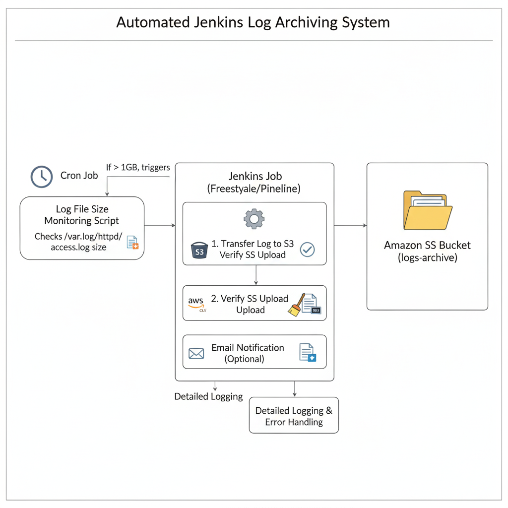
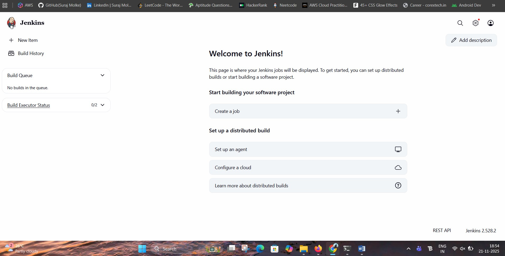
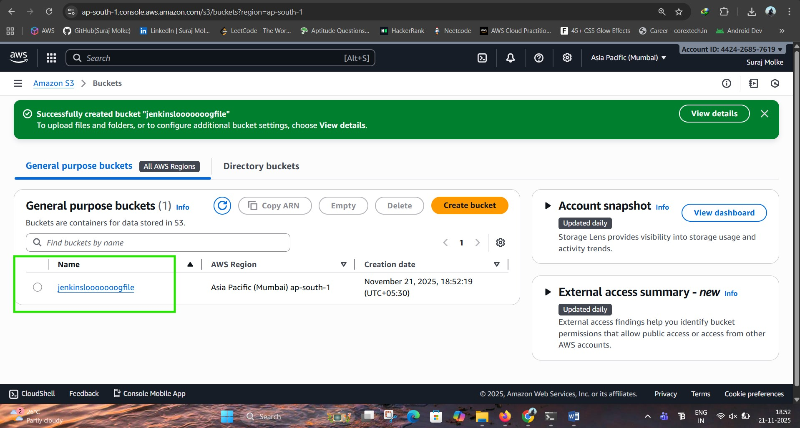
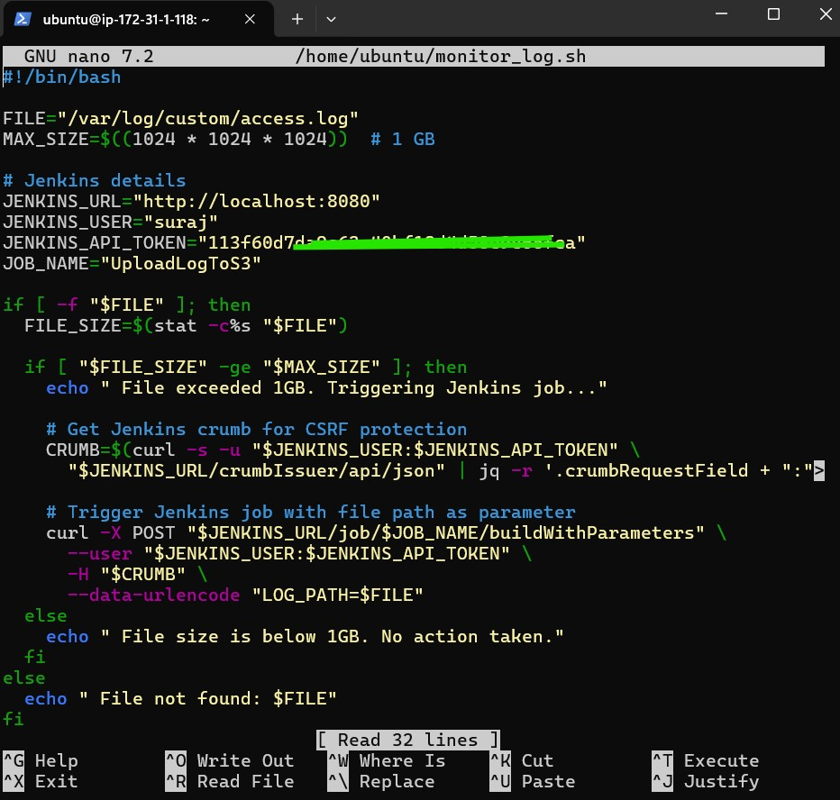
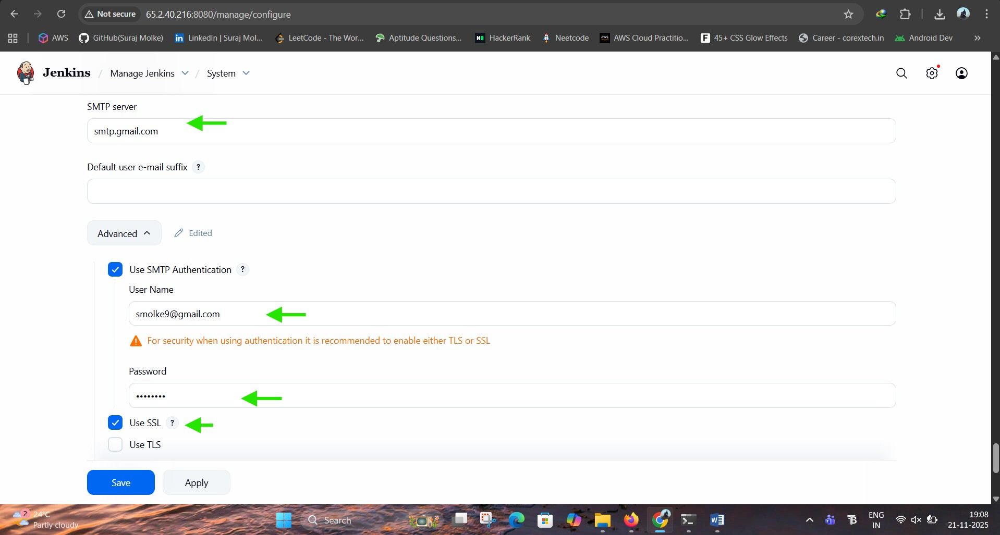
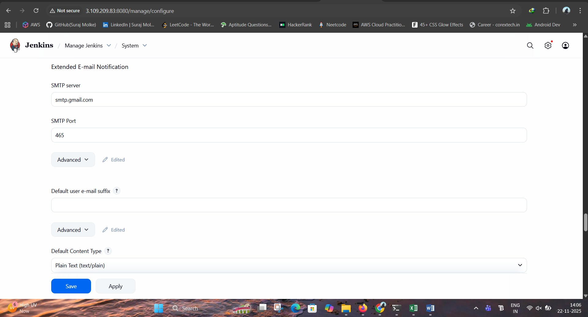
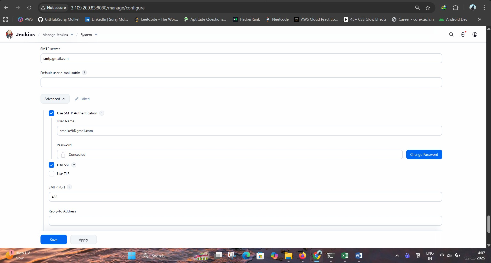
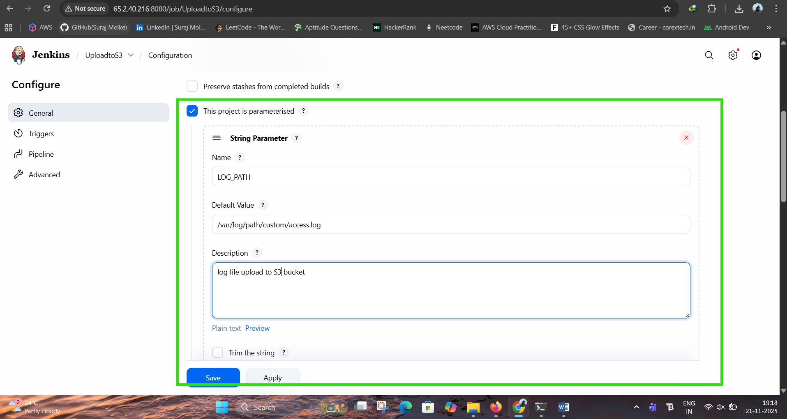
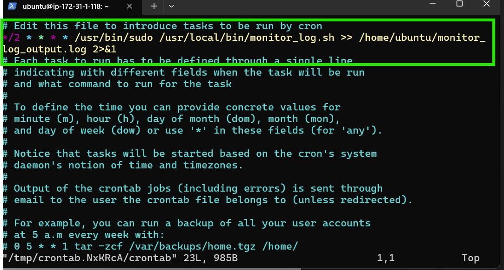
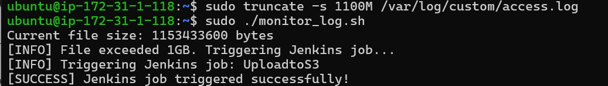

# 🚀 Automated Jenkins Job Triggered by Access Log Size

### Project 5 -- DevOps Automation

**Author:** Suraj Molke\
**Mentor:** Ravindra Bagle Sir, Swati Zampal Ma'am

## 📌 Project Overview

This project automates log monitoring and cloud backup by: 1. Checking
if `/var/log/custom/access.log` exceeds **1 GB** 2. Triggering a
**Jenkins Pipeline** 3. Uploading to **AWS S3** 4. Clearing the log file
5. Sending **email notifications**

## 🏗️ Architecture Diagram



## 🛠️ Technologies Used

-   Jenkins
-   Bash Script
-   AWS S3
-   Cron
-   Ubuntu Linux
-   Gmail App Password

------------------------------------------------------------------------

# 🛠️ **STEP-BY-STEP IMPLEMENTATION**

------------------------------------------------------------------------

# 🔹 **STEP 1: Initial Setup**

### **I. Update Ubuntu**

``` bash
sudo apt update && sudo apt upgrade -y
```

### **II. Install Java**

``` bash
sudo apt install openjdk-17-jdk -y
```

### **III. Install Jenkins**

``` bash
curl -fsSL https://pkg.jenkins.io/debian-stable/jenkins.io-2023.key | sudo tee /usr/share/keyrings/jenkins-keyring.asc > /dev/null

echo deb [signed-by=/usr/share/keyrings/jenkins-keyring.asc] https://pkg.jenkins.io/debian-stable binary/ | sudo tee /etc/apt/sources.list.d/jenkins.list > /dev/null

sudo apt update
sudo apt install jenkins -y
```

### **IV. Start & Enable Jenkins**

``` bash
sudo systemctl start jenkins
sudo systemctl enable jenkins
```

### **V. Unlock Jenkins**

``` bash
sudo cat /var/lib/jenkins/secrets/initialAdminPassword
```


------------------------------------------------------------------------

# 🔹 **STEP 2: Create S3 Bucket**

Use AWS Console → S3 → Create bucket\
Name example: `access-log-archive-s3`

------------------------------------------------------------------------

# 🔹 **STEP 3: Create Shell Script to Monitor Log Size**

### Create script:

``` bash
nano ~/monitor_log.sh
```

### Script includes the following logic:

-   Define log file path\
-   Define size limit (1GB = 1073741824 bytes)\
-   Jenkins URL\
-   User + API Token\
-   Get CSRF crumb\
-   Trigger Jenkins job with parameters\
-   If size \< limit → exit\
-   If file missing → exit

### Make script executable:

``` bash
chmod +x ~/monitor_log.sh
```


------------------------------------------------------------------------

# 🔹 **STEP 4: Create Jenkins API Token**

Jenkins → Manage Jenkins → Configure → API Token

Why? - Secure authentication\
- Used by script to trigger pipeline\
- Avoid using passwords

------------------------------------------------------------------------

# 🔹 **STEP 5: Setup Email Notifications in Jenkins**

### Steps:

1.  Go to **Manage Jenkins → Configure System**
2.  Scroll to **Extended E-mail Notification**
3.  Configure:

```{=html}
<!-- -->
```
    SMTP Server: smtp.gmail.com
    Port: 465
    SSL: Enabled
    Username: <your Gmail>
    Password: <Gmail App Password>

### Google App Password Steps:

1.  Go to: https://myaccount.google.com/security\
2.  Enable **2-Step Verification**\
3.  Go to **App Passwords**\
4.  Generate password for "Jenkins"



### Test Email:

Click "Test Configuration" → Should send successfully.

------------------------------------------------------------------------

# 🔹 **STEP 6: Create Jenkins Pipeline Job**

### 1. Go to Jenkins → New Item

Enter name: **UploadLogToS3**

### 2. Choose **Pipeline**

### 3. Add Parameter

-   **String Parameter**
    -   Name: `LOG_PATH`

### 4. Add AWS Credentials

(credentials → add → AWS key & secret)


------------------------------------------------------------------------

# 🔹 **STEP 7: Setup Cron Job**

### Move script to system path:

``` bash
sudo cp /home/ubuntu/monitor_log.sh /usr/local/bin/monitor_log.sh
sudo chmod +x /usr/local/bin/monitor_log.sh
```

### Edit crontab:

``` bash
crontab -e
```

### Add this schedule (every 2 minutes):

    */2 * * * * /usr/bin/sudo /usr/local/bin/monitor_log.sh >> /home/ubuntu/monitor_log_output.log 2>&1


------------------------------------------------------------------------

# 🔹 **STEP 8: Testing**

### 1. Create a dummy 1GB log file:

``` bash
truncate -s 1G /var/log/custom/access.log
```

### 2. Run script manually:

``` bash
sudo ./monitor_log.sh
```

### 3. Expected Results:

✔ Automatically builds Jenkins pipeline triggers\
✔ Log uploads to S3\

✔ Log cleared\
✔ Email notification sent


------------------------------------------------------------------------

# 🏁 **Conclusion**

This project successfully automates log management using:

-   **Bash Script**
-   **Jenkins Pipeline**
-   **AWS S3**
-   **Cron Jobs**
-   **Secure API Token Authentication**
-   **Email Notification Alerts**

It ensures:

✔ Reduced disk space usage\
✔ Automatic cloud backup\
✔ Zero manual intervention\
✔ Scalable & production-ready workflow

------------------------------------------------------------------------

# 📎 **Author**

**Suraj Molke**\
LinkedIn: https://www.linkedin.com/in/suraj-molke-4656002a6/\
GitHub: https://github.com/Smolke9\
Email: smolke9@gmail.com
